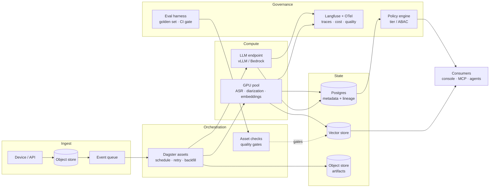

# Enterprise architecture for a local AI pipeline

A reference for what plaudvault becomes at organisational scale, and — more usefully —
for **when each change is worth making**. Nothing here is planned work. plaudvault is a
single-user system on one machine and most of this would make it worse.

It exists because the question "what does this look like in an enterprise environment"
has a real answer, and because the answer is mostly *not* about adopting frameworks.

> Companion to [PRODUCT-BIBLE.md](PRODUCT-BIBLE.md), which records what was built and
> why. This one records what would change under different constraints. Where they
> disagree, the bible wins — it describes something that exists.

---

## 1. The category error to clear first

"MLOps for my pipeline" gets answered with LangChain about half the time. That is the
wrong layer.

| | What it is | Examples |
|---|---|---|
| **Application framework** | Composes model calls into a chain, a retriever, an agent loop | LangChain, LlamaIndex, Haystack |
| **Orchestration** | Schedules work, handles retries, backfills, lineage, dependencies | Dagster, Airflow, Prefect, Temporal |
| **Serving** | Runs the model, batches requests, manages GPU memory | vLLM, Triton, Ollama, Bedrock |
| **Observability** | Traces, cost, latency, quality of model calls | Langfuse, OpenTelemetry, Arize |
| **Evaluation** | Is the output actually good, and did it get worse? | Golden sets, LLM-judges, offline harnesses |

plaudvault is **a batch data pipeline that happens to call models**. Its orchestration
peer group is the second row. LangChain would replace roughly forty lines of `llm.py`
and add a dependency with a fast-moving API — a bad trade for a system whose LLM usage
is "send a prompt, get text back, parse it".

The one member of that family with a real claim here is **LangGraph**, for the dispatch
loop in `dispatch.py`. Even there, the existing state machine — `queued → claimed →
done`, with the claim guard inside the `UPDATE` so two agents cannot both win — is
already correct and dependency-free. Adopt it only if the agent workflows grow
branches, and prefer **Temporal** if what you actually need is durable execution across
process restarts.

---

## 2. What already exists

The instinct is to describe the current system as "a Python script". It is not. It has
most of the properties an orchestrator is adopted to provide:

| Property | Implementation | Where |
|---|---|---|
| Idempotency | `needing_title()`, `needing_index(model)`, `needing_diarization()` | `store.py` |
| Checkpointing | `transcribed_at`, `sentiment_at`, `titled_at`, `diarized_at` | `store.py` |
| Failure isolation | per-item `try/except`; one bad file does not kill a run | every stage |
| Mutual exclusion | advisory lock with stale-PID recovery | `runlock.py` |
| Lineage | `transcribe_model`, `summary_model`, `sentiment.model`, `chunks.model` | schema |
| Data-quality gate | `freshness.report()` | `freshness.py` |
| Backfill | `--force`, per stage | CLI |
| Access control | `tier`, enforced by what exists on disk | `tiering.py` |

Two of those are better than what most production systems have, and they are worth
naming explicitly because they are the transferable part:

**Reconciliation, not task chaining.** `needing_X()` asks "what is missing?" and can run
from any state without knowing what ran before. That is the declarative model — the same
shape as Kubernetes controllers and Dagster assets — and it is why the Dagster wrapper in
[`examples/dagster/definitions.py`](../examples/dagster/definitions.py) is four lines per
stage instead of a rewrite. An imperative DAG would have had to be re-architected.

**Per-artifact model identity.** Every derived artifact records the model that produced
it. Changing the embedding model re-indexes rather than silently mixing two vector
spaces. This is model lineage, and it is the thing most teams discover they need after
an incident rather than before.

---

## 3. Reference architecture

The shape barely changes. What changes is that each box becomes a thing that can fail
independently, be scaled independently, and be observed independently.

---

## 4. Layer by layer

### Ingest — poll becomes push

Today `sync` polls the Plaud API on a schedule. At scale: arrival lands audio in object
storage and emits an event. Decoupling arrival from processing is what lets a backlog
drain at whatever rate the GPU pool allows, instead of a fixed schedule either falling
behind or running empty.

**Keep:** `D1`'s three independent completeness checks (size, container magic bytes,
sha256). Verification-on-arrival is correct at any scale, and "the md5 matched" and "the
audio is usable" being unrelated properties does not stop being true.

**Keep:** `D16`. Sync only ever adds. An upstream deletion must never reduce the archive.

### Orchestration — Dagster, when there is a second worker

See [`examples/dagster/definitions.py`](../examples/dagster/definitions.py) for the
working sketch: 10 assets, 3 asset checks, loading against the real stage functions.

The single most important thing it buys is **the GPU concurrency limit**. One GPU, one
process is currently enforced by the fact that `_run_stages` is sequential. The moment
anything runs in parallel, transcription and diarization will both grab the GPU and
thrash. An orchestrator solves this with a concurrency pool; a hand-rolled scheduler
relocates the problem.

The second is **asset checks as gates**. `freshness.report()` and the eval harness
already compute the right things, but nothing stops a bad index being used. As a check,
retrieval quality can block the downstream asset.

**Airflow** is the wrong fit here specifically — it orchestrates tasks, and this system
is naturally expressed as assets. **Prefect** fits if workflows are dynamic. **Temporal**
fits the *agent dispatch* half far better than either, because those are long-running,
have external effects, and need compensation on failure — a fundamentally different
problem from batch reconciliation and worth keeping separate.

### Compute — separate the CPU orchestration from the GPU work

The current design runs everything in one process, which is why `transcribe`,
`diarize` and `index` all block each other. At scale:

- GPU stages become workers pulling from a queue, autoscaled on queue depth
- LLM calls go to a served endpoint (vLLM for throughput, Bedrock/SageMaker for managed)
  rather than a localhost singleton
- Batch inference beats per-item calls by an order of magnitude for embeddings

**Ollama is the first thing that breaks under concurrency.** It is a fine single-user
runtime and is not a serving layer.

**Keep:** `D8`. Embeddings go through a local model even when the chat model is remote.
Indexing sends every sentence in the corpus, which is a categorically larger disclosure
than summarizing one file, and it must not inherit a setting made for the latter. This
becomes *more* important with a hosted endpoint, not less.

### State — the boring answer is usually right

| Now | Then | Trigger |
|---|---|---|
| SQLite (WAL) | Postgres | A second concurrent **writer**. Not data volume. |
| float32 BLOBs + numpy | pgvector | ~10⁵–10⁶ chunks |
| pgvector | Qdrant / Milvus | ~10⁷ chunks, or filtered-ANN needs |
| Local filesystem | Object storage | More than one machine needs the artifacts |

**`D7` is still correct and the numbers are not close.** The corpus is ~1,300 chunks
against a stated revisit point of ~100,000 — a factor of 75. A vector database today
would add a dependency, a daemon and an index to corrupt in exchange for nothing
measurable.

### Observability — where Langfuse fits

Two distinct concerns that get conflated:

**System observability** — did the pipeline run, what failed, how long did it take.
OpenTelemetry traces + whatever the org uses. `freshness.report()` is a data-quality
signal and belongs as an asset check, not a metric.

**Model observability** — what prompt, what completion, how many tokens, what cost, what
latency, and was the output any good. This is what **Langfuse** is for, and there is
already a Langfuse instance in the sovereign-context stack.

The integration point is deliberately narrow: **`llm.generate()` and `search.embed()`
are the only two functions in the codebase that talk to a model.** Wrapping those two
covers every model call the system makes — summaries, titles, tone, extraction,
embeddings, eval generation — with no changes anywhere else. That is worth stating
because it is a property of the current design that would be expensive to recover if
lost: no module reaches for a model directly.

A span should carry the recording id, the stage name, and the model label, so a cost
report can be grouped by *what the money was spent on* rather than by prompt template.
The privacy consequence needs stating plainly: **Langfuse sees prompt and completion
text.** For this corpus that means family conversations. Self-hosted only, and the same
`tier` logic that governs the MCP server should govern what is traced — or trace
metadata only, with text redacted.

### Governance — the actual differentiator

Most production ML systems do this badly, and plaudvault does it unusually well. In
order of how rare they are:

1. **Provenance verification.** `D9` — every extracted action's quote is checked against
   its transcript, because a fabricated citation defeats the audit it exists to support.
   Measured, tuned on real data, 253 kept and 2 dropped.
2. **Physical rather than advisory access control.** A `stack` tier is a file that
   exists. Untier it and the copy is deleted. A tier stored only in a database is a
   promise.
3. **Human-in-the-loop as a typed state.** `proposed → accepted` is in the schema, not a
   convention. Nothing reaches an agent that a human did not accept (`D20`).
4. **Machine confidence made visible.** A voiceprint match is drawn as a guess and never
   feeds the identity it was matched against (`D18`).

At enterprise scale these become: policy engine (OPA) for tier decisions, an audit log
with an immutable store, and a model registry keyed to the artifacts each version
produced. The *design* does not need to change — only the enforcement point moves.

---

## 5. Evaluation

This was the real gap and is now partially closed. `plaudctl eval` measures retrieval
against a labelled query set. Three design decisions worth keeping:

**The golden set lives in the archive, not the repo.** A query like "what did the
consultant say about the equity split" is as personal as the recording it points at, and
this repository is public. `{archive}/eval/golden.jsonl`.

**Generated queries are proposals.** `eval build` writes them `verified: false` and they
are excluded from the headline number until confirmed. A generated query is scored
against the recording it was generated *from*, which measures a strictly easier task
than the one you care about.

**Direct and oblique queries are measured separately.** A query naming a person or a
company is found almost regardless of retrieval quality — the first six generated
queries scored **recall@1 = 1.000**, which is not a good result but a broken instrument:
no headroom in either direction means no regression can ever be detected. Oblique
queries — the gist with none of the shared vocabulary, "was I underpaid" against "not
exactly making it worth my while" — are the case retrieval exists for and the number
that moves.

The harness prints a saturation warning when it stops being able to discriminate, which
is the property that makes it trustworthy: **a harness that overstates quality is worse
than no harness.**

### What this unblocks

- `D-open-1` — do `search_query:` / `search_document:` prefixes help? Re-index and
  compare labelled runs.
- `D-open-3` — is 1200 chars the right chunk size for both snippets and answer context?
- `B4` — neighbour expansion, measurable instead of assumed.

### What is still missing

- **Generation quality.** Retrieval is measured; whether an answer built on those hits
  is *correct* is not. That needs either a human-labelled answer set or an LLM judge,
  and an LLM judge needs its own validation against human labels before it is worth
  anything.
- **Online signal.** No feedback from real searches. A thumbs-up in the console, sampled,
  would beat any amount of synthetic data.
- **Extraction precision** (`B8`). Roughly half the surviving commitment proposals are
  rhetorical. Measurable with the same machinery, unmeasured today.

---

## 6. When to adopt what

The only genuinely useful table in this document. **Triggers, not timelines.**

| Change | Adopt when | Not before, because |
|---|---|---|
| Eval harness | **Now — done** | An MCP client is answering questions from an unmeasured index |
| Langfuse on `generate`/`embed` | Cost or quality becomes a question you cannot answer | Two functions, an afternoon; wait until there is a question |
| Dagster | A second worker or machine exists | Adds a daemon, a database and a web server to a launchd plist |
| Postgres | A second concurrent **writer** | WAL handles one writer + N readers fine |
| Served LLM endpoint | Concurrent pipeline workers | Ollama is fine for one sequential pipeline |
| Vector database | ~10⁵–10⁶ chunks | Currently ~1,300. Factor of 75 away |
| Temporal | Agent workflows grow branches or need durable retries | The current state machine is correct |
| Object storage | More than one machine needs artifacts | One drive, one machine |
| Policy engine (OPA) | More than one person's data, or a second enforcement point | One tier check, one place |

Note that **six of nine triggers are about concurrency or multi-tenancy, not data
volume.** At 36 hours of audio there is no data problem. Migrating storage now would
look like progress and buy nothing.

---

## 7. What not to do

- **Do not adopt LangChain here.** It replaces `llm.py` with a dependency whose API moves
  faster than this codebase does, and buys nothing the forty lines do not already do.
- **Do not add a vector database before ~10⁵ chunks.** `D7`, and the measurement behind
  it, still holds.
- **Do not expose the console beyond loopback without an identity proxy.** It has no auth
  by design. A tunnel is not a substitute for authentication.
- **Do not let a downstream index hold a copy of `stack/`.** Deleting a file here cannot
  reach a row and an embedding that already live elsewhere; tiering stops being
  enforceable. Query the archive instead — that is what the MCP server is for.
- **Do not trace prompt text to a hosted observability service.** The prompts contain
  family conversations.
- **Do not let an eval number rise without checking whether the set saturated.** A
  metric at ceiling is a broken instrument, not a good score.

---

## 8. If this were an interview answer

The orchestrator is the commodity layer. Any competent team can wire up Dagster.

What is scarce, and what this system happens to demonstrate, is the governance model:
provenance verification on every generated claim, access control enforced by physical
fact rather than a flag, human acceptance as a typed state that machines cannot bypass,
and machine confidence surfaced rather than hidden. Those are the properties that
determine whether an AI system can be trusted with something that matters — and they are
the ones most often retrofitted after an incident.

The measurement gap was real and is the honest weak point: the system had citations
before it had any evidence its retrieval was good. That is the failure mode worth being
able to describe, because it is extremely common and it is invisible from the outside —
a confident answer over a bad hit looks exactly like a confident answer over a good one.
