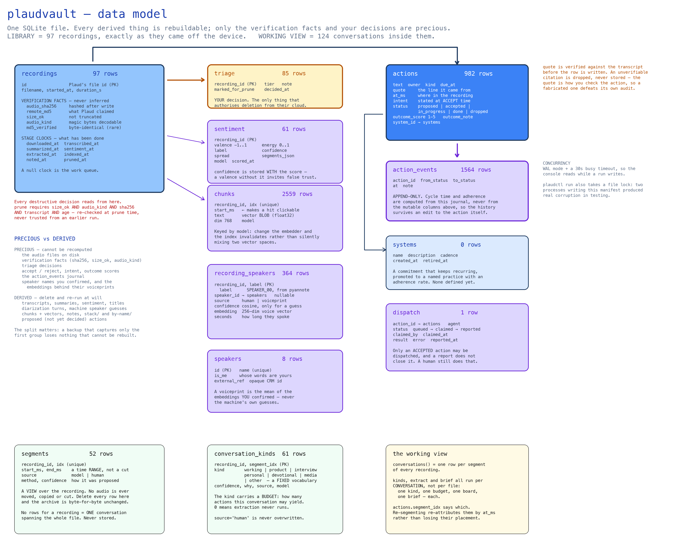
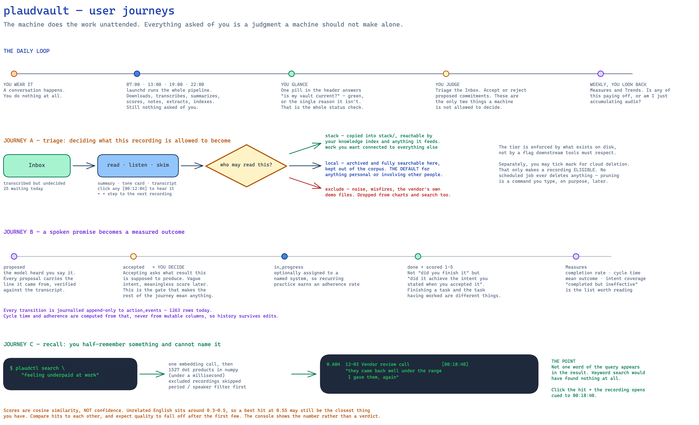

# plaudvault — product bible

The reference document for what this is, why it is built the way it is, what is done,
and what is next. Everything in here is meant to survive the conversation that produced
it.

> **Maintenance:** the *Status*, *Shipped*, and *Metrics* sections are regenerated from
> the repository and the live archive by `scripts/sync-docs.py`. Everything else —
> decisions, backlog, roadmap — is written by hand and only ever appended to. See
> [Keeping this current](#keeping-this-current).

---

## 1. What this is

Plaud sells a wearable recorder whose audio can only leave the device via their app and
their cloud. They charge for **transcription minutes**, not storage — storage is free
and unlimited. That pricing is the seam this product lives in.

plaudvault lets their cloud be a sync pipe and nothing more. Audio is pulled down over
their API, verified, and then transcribed, summarized, tone-scored, mined for
commitments and indexed for search **entirely on your own machine**. Their AI never
touches the audio, so the paid minutes stay unspent and the transcript never leaves
127.0.0.1.

**What it explicitly does not do:** get audio off the device without their cloud. Plaud
disabled raw USB access in firmware 2.1 and the pin models never had it. "Private" here
means *your storage, your transcription, your summaries, your search, and
delete-after-archive* — not never-touches-their-servers. If that distinction matters, it
should, and no amount of software on this end changes it.

### Who it is for

One person, on their own machine, with their own recordings. There is no multi-user
story, no hosted mode, and no auth on the console — because it binds to loopback and
serves family conversations off a local disk. Every design decision below assumes that.

---

## 2. The three ideas that everything else follows from

**1. Their cloud is a pipe; understanding is local.** Every stage that interprets your
speech — ASR, summary, tone, commitments, embeddings — runs against a model on your
machine. The only network calls are: authenticate, list, download, and (deliberately,
manually) delete.

**2. Tiering is physical, not advisory.** A recording tiered `stack` is *copied* into
`stack/`, the only directory a knowledge index is pointed at. Untier it and the copy is
deleted on the next run. A tier stored only in a database is a promise; a tier enforced
by what exists on disk is a fact. This matters because a pin records whoever is in
earshot, and none of them opted in — defaulting personal recordings to `local` is the
difference between an archive and a surveillance corpus.

**3. The machine proposes; the human decides.** Extraction, tone scores and search
results are all *suggestions*. Nothing reaches a board, a corpus, or a deletion queue
without a human acting. Where the machine cannot be trusted, the design makes that
visible rather than hiding it behind a confident interface.

---

## 3. Architecture


`plaudctl run` executes six stages under a single advisory lock:

```
sync → transcribe → diarize → summarize → title → sentiment → notes → extract → index → tier
```

| Stage | Engine | Produces |
|---|---|---|
| `sync` | Plaud API + httpx | `audio/YYYY/MM/*.mp3`, verification facts |
| `transcribe` | mlx-whisper (Apple GPU) / faster-whisper | `transcripts/*.txt` |
| `diarize` | pyannote (optional) | `diarization/*.json`, `recording_speakers` rows, named transcripts |
| `summarize` | qwen3:8b via Ollama | `summaries/*.md` |
| `title` | qwen3:8b via Ollama | `recordings.title` |
| `sentiment` | qwen3:8b via Ollama | `sentiment` rows |
| `notes` | — | one Obsidian note per recording |
| `extract` | qwen3:8b via Ollama | `actions` rows (proposed) |
| `index` | nomic-embed-text via Ollama | `chunks` rows + vectors |
| `tier` | — | reconciles `stack/` with triage |

### Data model



### User journeys



---

## 4. Technical decisions

Each entry is a decision that was genuinely contested, with the reasoning that settled
it. Superseded decisions are struck through rather than deleted.

### D1 — Judge download completeness by size, not by md5
Plaud's `file_md5` describes the *original on-device file*. The MP3 their storage layer
serves usually carries a 512–640 byte ID3 tag, so the md5 matches only for the minority
served untouched. Treating a mismatch as corruption would condemn most of the archive to
being un-prunable forever.

Worse, the naive check gets it *backwards*: before transcoding finishes, the `.opus` URL
returns the raw on-device blob (starts `0xB8 0x60`), which no decoder will touch — and
whose md5 matches exactly, because it *is* the original. "md5 matched" and "usable
audio" are unrelated properties.

**Decided:** three independent checks — size (short = truncated, refuse), container
magic bytes (undecodable = still transcoding, keep but don't count), and sha256 recorded
at download and re-verified by `plaudctl verify`.

### D2 — Pruning is locked behind a probe receipt
Plaud's delete endpoint is *inferred* from the `is_trash` field on the listing response,
not documented or observed. Bulk deletion stays locked until a probe run trashes exactly
one recording and confirms via the API that it moved. The proof is written to
`prune-probe-receipt.json`; delete the receipt and you are locked again. No scheduled
job ever prunes.

### D3 — One advisory lock for the pipeline
A scheduled sync four times a day plus a "Sync now" button means two runs overlapping is
a matter of when, not if. Two processes writing the same SQLite manifest produced real,
observed corruption. WAL makes that survivable; the lock makes it not happen. A lock
whose PID is gone is treated as stale, so a killed run cannot wedge the pipeline.

### D4 — Sentiment is scored per segment, then reduced
A two-hour conversation that turned partway through would average out to a bland neutral
under a whole-transcript score. Segments are scored separately and reduced; valences that
straddle zero by more than a threshold produce `mixed` rather than a false neutral.
Verified on real data: two recordings scored −0.07 and −0.06 that a plain mean would have
filed as "neutral" are correctly labelled `mixed`.

### D5 — Confidence is stored with every tone score, and shown
This is a language model reading ASR, which has no tone of voice in it. The prompt asks
for the model's own confidence, low-confidence readings are drawn hollow and excluded
from the trend line by default.
**Observed limitation:** on the real corpus every reading came back 0.80–0.95, so the
mechanism has never actually fired. The confidence channel is compressed and currently
close to uninformative. Recorded rather than hidden.

### D6 — The trend chart uses a diverging teal↔terracotta scale, not green↔red
Green/red is the intuitive choice for good/bad and the worst possible choice for
colour-vision deficiency. The poles used here stay 12.5–15.6 ΔE apart under simulated
protanopia and deuteranopia (validated with a script, not by eye), every step clears 3:1
contrast on both light and dark surfaces, and position on the axis plus a table view
carry the value independently of colour.

### D7 — Brute-force vector search, no vector database
~20 hours of audio is ~700 chunks. 700 dot products against a 768-dim vector is well under
a millisecond in numpy — far below the cost of the single network call that embeds the
query. A vector DB would add a dependency, a daemon, and an index to corrupt in exchange
for nothing measurable. Vectors live as raw float32 in the same SQLite file, so the
archive stays one directory you can copy. *Revisit at ~10⁵ chunks.*

### D8 — Embeddings always go through Ollama, even when the chat model is remote
Indexing sends every sentence you have ever recorded. That is a categorically larger
disclosure than summarizing one file, and it must not silently inherit a setting made
for the latter. `embed_model` is a separate config key with no remote option.

### D9 — Every extracted action's quote is verified against its transcript
Found by reading the board, not the code: two proposals were verbatim copies of the
prompt's own worked example — an action to *"Schedule a review call with Dana"* quoting
*"I need to email Dana to set up the review call"*, when "Dana" appears in none of the 32
recordings. A small model sometimes returns the few-shot example instead of reading the
input.

That is worse than a wrong action. The quote exists so a human can check the action
against the recording, so a fabricated quote defeats the audit it is there to support.

Pure verbatim matching was measured and rejected: on the live 255-item board it would
have discarded 23 sound paraphrases to catch 2 leaks. **Decided:** a quote passes if a
40-character run appears verbatim *or* ≥60% of its content words do. Measured result:
253 kept, exactly 2 dropped.

### D10 — Extract commitments only; suggestions are opt-in
Measured on the real corpus (33 recordings, 19.3h): 198 suggestions against 57 commitments, and the suggestions
were largely not tasks — topic summaries (*"Discuss the app's features"*), things that
had already happened during the call (*"Share the screen to show the app concept"*), and
bare noun phrases (*"Secure and compliant infrastructure for managing IP"*). They were
grounded in the recording, so D9's quote check cannot catch them: the failure is
judgment, not fabrication.

Suggestions are removed from the prompt entirely rather than filtered from the response —
a category that is merely *mentioned* is one the model will populate. A backstop drops
any the model volunteers anyway, and says so.

### D11 — The freshness verdict ignores work waiting on the human
Untriaged recordings and unreviewed proposals are reported but never counted against
"up to date". An indicator that turns amber because you have reading to do is one you
learn to ignore. The verdict covers only what the *machine* owes.

### D12 — Prev/next captures a snapshot of the list, not a live query
Triaging a recording removes it from the live Inbox query. A list that re-derived itself
between steps would shift under you mid-pass — you triage one, land two further on, and
never see the one in between.

### D13 — `service install` verifies with launchd rather than trusting `bootstrap`
Observed: the sync agent reported as installed while `launchctl print` could not find it,
because every launchctl call went through a helper that captured output and discarded the
return code. A bootstrap that lost the race to its own plist write left a "scheduled" sync
that would never have run — and you would only discover it when recordings quietly stopped
syncing.

### D15 — `exclude` means out of the console *and* out of the pipeline
The console is a workspace, so noise you have already judged as noise must stop asking
for attention. `exclude` was half-built: it dropped a recording from Trends, Search and
`stack/` but left it in the Library, and the pipeline kept summarizing, tone-scoring,
mining and embedding it — spending model time on material already declared worthless.

**Decided:** one predicate, `Store.NOT_EXCLUDED`, spelled once and used by every
"what still needs doing" query, so the console and the pipeline can never disagree
about what counts.

Freshness had to follow, or the pill would sit amber forever over work nobody wants
done — the same cry-wolf failure D11 exists to prevent.

Three properties make dismissing safe enough to do on one click with no dialog:
- **Nothing is deleted.** Audio, sha256, size and container facts are untouched, so the
  recording stays verifiable and prunable later.
- **It is permanent.** Triage lives in its own table; `upsert_remote` writes only
  `filename`, `remote_md5`, `remote_size` and `meta_json`, so a re-sync refreshes
  metadata and leaves the decision alone. Verified by a test that re-lists every
  recording with changed names and asserts the dismissal survives.
- **It is reversible and visible.** A `show dismissed` toggle restores them, and the
  Library always prints the hidden count — quiet by default must never become silently
  missing.

### D16 — Deleting from Plaud must never reduce the local archive
The archive is the copy of record; the cloud is a pipe. Deleting a recording in Plaud's
app — rather than via `plaudctl prune` — is a legitimate workflow, and the Plaud account
may legitimately end up empty.

`sync` only ever adds. It never deletes a local row or file because something vanished
from the listing. Proven by a test that syncs against a client returning zero
recordings and asserts all local rows and audio files survive.

### D17 — A title is written from the summary, and a human's is never overwritten
Plaud names a file after the clock. That is fine for a filesystem and useless for an
inbox: thirty rows of timestamps tell you nothing about which one was the call with the
lawyer.

Titles are generated from the **summary**, not the transcript, because the summary has
already done the map-reduce over a long conversation and its Key points are a far better
title source than the first 8k characters of raw ASR. Recordings under
`summarize_min_seconds` never get summarized, and those are exactly the voice memos whose
timestamp tells you least — so they fall back to the transcript.

Two guards, both measured against the failure they exist to prevent:
- **`title_source` records who wrote it.** `--force` re-titles the machine's own work and
  never yours, the same rule triage lives by. Clearing the title in the console is how you
  say "your title was wrong, try again".
- **A title that names nothing is refused.** A model that cannot find a subject reaches
  for "Business Discussion", and thirty of those are no better than thirty timestamps. If
  every word of the proposal is generic the recording stays unnamed, which is honest.
  Measured on the live corpus: 49 of 50 named, 1 correctly declined.

The device's filename is shown alongside the title everywhere, so a title you disagree
with never hides what the file actually is.

### D18 — Only a human confirmation builds a voiceprint
Diarization produces anonymous labels — `SPEAKER_00` — which are per-recording and
useless across an archive, because `SPEAKER_00` is a different person in every file. The
value is entirely in the identity laid over them: name a voice once, keep its embedding
as a **voiceprint**, and the next recording matches by voice rather than asking again.

The obvious implementation feeds every match back into the mean, and it is wrong. An
automatic match that is treated as evidence compounds: the identity slowly becomes
whoever the machine has been mistaking for you, and nothing in the data says when it went
wrong. So `source` distinguishes `human` from `voiceprint`, only `human` rows build the
mean, and the console draws a machine match as a visible guess rather than as a fact.

Three properties follow, each covered by a test:
- **Re-running diarization never un-names anybody.** Attribution lives in its own column,
  exactly as triage survives a re-sync.
- **A correction reaches the identity, not just the label.** Taking back an attribution
  rebuilds that person's voiceprint without it, so a mistake does not stay baked in.
- **The rendered transcript is derived, never authoritative.** Names are re-applied from
  the database on demand, so a rename rewrites every transcript that person appears in.

The mean is weighted by speaking time: a thirty-second cameo should not move an identity
as far as an hour of conversation. Degenerate embeddings are dropped — pyannote pads
under-sampled clusters with zeros, and a zero vector matches everything at cosine 0 and
nothing usefully.

### D19 — Diarization is optional, and its absence must not turn the pill amber
pyannote pulls ~2 GB of torch and needs a HuggingFace licence accepted for two gated
models. That is a real cost to impose on somebody who only wants transcripts, so it is an
extra (`pip install 'plaudvault[speakers]'`) and every other stage works without it.

The consequence that matters is in freshness: if undiarized recordings counted as
outstanding work on a machine with no token, the indicator would sit amber forever over
work nobody can do — the exact cry-wolf failure D11 and D15 exist to prevent. So the
diarize stage reports zero pending unless diarization is actually available, and
`plaudctl speakers status` says precisely what is missing and which licence page to open.

### D20 — Only an accepted action can be dispatched, and a report is not a completion
Handing an action to an agent points something that can act in the world at a sentence a
small model extracted from noisy ASR of a family conversation. Three constraints, and
none of them has an override flag:

1. **Only `accepted` (or `in_progress`) can be handed over.** `proposed` is the
   extractor's guess, and D10/B8 measure it as over-proposing. Requiring acceptance means
   a human read the quote before anything could act on it.
2. **Dispatch is a request, never an execution.** plaudvault writes a row and waits.
   Whatever the agent can do, it could already do; this only tells it what you want, so
   the blast radius is the agent's and not the archive's.
3. **A finished job is a report.** The result lands on the dispatch row and the action
   stays open. An agent that believes it booked a meeting and did not must not be able to
   tick the box itself.

The quote and the recording travel with the job, because an agent told to "set up the
meeting" with no source cannot tell a real commitment from a garbled one — the same
reason D9's quote verification exists. Claiming is atomic (the status guard is in the
`UPDATE`, not a read-then-write), so two agents polling one queue cannot both believe
they won.

### D21 — The MCP server sees everything except `exclude`, not only `stack`
§9 settles that the *cognitive stack* sees `stack`-tiered recordings only, and that has
not changed. This is a different client: an MCP server on stdio, launched by the owner's
own agent on the owner's own machine, which is nearer to the console than to a corpus
crossing a boundary. Scoping it to `stack` would have made it useful for 7 of 57
recordings and answered almost nothing.

So `mcp_tier_scope` defaults to `stack,local,untriaged` — what the console shows. Three
things keep that from being a quiet widening of the archive's blast radius:
- **`exclude` is unreachable through every path** and is not expressible in the scope.
- **Audio is never served.** The transcript is the surface.
- **The scope is per-invocation.** `plaudctl mcp --tiers stack` hands a particular client
  a narrower view than the console has, so a client that should not see family
  conversations does not, without changing the config for the others.

Tier is still enforced in exactly one place. What changed is the default, and it is
recorded here because the reasoning is the sort that gets re-litigated.

### D14 — qwen3:8b, not the largest model available
`qwen3.8` (27.3B, Q4_K_M, 17.7 GB) was pulled and **cannot load** on a 24 GB machine:
5m04s of thrashing, swap climbing, then `timed out waiting for llama-server to start`,
with the daemon dying. The weights alone are 94% of non-wired RAM before any KV cache.
It is already at the standard 4-bit quant, so there is no smaller variant of that tag,
and the failure happened at `num_ctx: 8192` — the smallest plaudvault ever requests —
so context length was never the constraint.

qwen3:8b does 22 recordings in 14 minutes with zero failures. **Corollary:** score the
whole corpus with one model. The `sentiment.model` column makes a switch traceable, but
a mid-corpus change puts a seam in the trend that looks like a mood shift and is not.

---

## 5. Status

<!-- BEGIN:STATUS (generated — do not edit by hand) -->
_Generated 2026-08-30 from git and the live archive._

### Codebase

| | |
|---|---|
| Python modules | 27 |
| Lines of Python | 8,099 |
| Commits | 15 |
| CLI verbs | 25 — `login`, `logout`, `status`, `fresh`, `sync`, `verify`, `index`, `search`, `story`, `title`, `diarize`, `speakers`, `dispatch`, `mcp`, `tier`, `web`, `init`, `service`, `run`, `prune`, `transcribe`, `summarize`, `sentiment`, `notes`, `extract` |

Largest modules: `store.py` (832), `web.py` (825), `story.py` (804), `cli.py` (751), `diarize.py` (456), `mcp_server.py` (417).

### Live archive

| | |
|---|---|
| Recordings | 57 |
| Transcribed | 57 |
| Tone scored | 56 |
| Indexed chunks | 1,258 |
| Triaged | 45 |
| Open commitments | 161 |
| Action events | 989 |
| Audio captured | 36.2 hours |
| Tiers | exclude 3 · local 1 · stack 41 |

<!-- END:STATUS -->

---

## 6. Shipped

<!-- BEGIN:SHIPPED (generated — do not edit by hand) -->
Newest first. Each commit message carries the full reasoning; this is the index.
Find one with `git log --grep="<subject>"`.

| Date | What landed |
|---|---|
| 2026-08-30 | Take the HuggingFace token from stdin when there is no terminal |
| 2026-08-30 | Name the recordings, name the voices, and let an agent do the work |
| 2026-08-24 | Replace a real consultation quote in the journeys diagram with a synthetic one |
| 2026-08-24 | Bulk edits, and the corpus drawn as themes over time |
| 2026-08-24 | Draw a recording along its own duration, not as a grid of cards |
| 2026-08-24 | Dismissing noise takes it out of the console and out of the pipeline |
| 2026-08-24 | Refresh bible status after the archive grew |
| 2026-08-23 | Drop the SHA column: a table cannot contain its own commit hash |
| 2026-08-23 | Document the whole thing: three diagrams, a product bible, and a way to keep it current |
| 2026-08-22 | Step between recordings without going back to the list |
| 2026-08-22 | Semantic search over transcripts, with timestamped hits |
| 2026-08-22 | Extract commitments only; suggestions become opt-in |
| 2026-08-22 | Refuse extracted actions whose quote isn't in the transcript |
| 2026-08-21 | Keep excluded recordings off the trend, and verify launchd actually loaded |
| 2026-08-21 | Own your Plaud recordings end to end |
<!-- END:SHIPPED -->

---

## 7. Backlog

Ordered within each tier by expected value, not effort. Nothing here is committed.

### Next — clear value, design settled

| # | Item | Why |
|---|---|---|
| B3 | **Retrieval evaluation harness** | Everything rests on retrieval quality nobody has measured properly — and now an MCP client answers questions from it, so the stakes went up. A labelled query set, measured rank, run on every change. Also settles the open prefix question (D-open-1). |
| B4 | **Neighbour expansion for answer context** | Chunks are 1200 chars, tuned for search snippets. An MCP client answering a question wants the hit plus its neighbours; `get_transcript` with a time window is the manual version of this. |
| B5 | **Date/tier filters ahead of vector search** | "What did I commit to last week" is a metadata question. Similarity alone cannot answer it. |

### Later — valuable, design not settled

| # | Item | Open question |
|---|---|---|
| B6 | **Topic trends over time** | Aggregation, not retrieval — clustering or per-period map-reduce. "How has my thinking on X changed" is a different build from RAG. |
| B11 | **Re-extract after diarization** | Named transcripts should improve `owner` on extracted commitments, which is half of B8. Nothing re-runs extraction when speakers change, so the gain is currently only realised on recordings diarized before their first extract. |
| B12 | **Contact-reference resolution** | `speakers.external_ref` carries an opaque id and nothing resolves it. Making "map this conversation to my CRM" real needs a resolver per system, and the question is whether plaudvault should hold one at all or hand the string to the agent. |
| B13 | **Reaching the archive from off-machine** | The MCP server is stdio and the console is loopback-only, so an agent on a remote VM cannot reach either. Needs a real identity proxy before it needs code — see Rejected. |
| B8 | **Better commitment precision** | 63→18 proposals after D10, but roughly half the survivors are rhetorical ("Make this a reality"). Rhetoric and commitment are grammatically identical to an 8B model. Needs a larger model or a second-pass judge — both were rejected once already. |
| B9 | **Backup/restore command** | The precious/derived split in the data-model diagram is the spec. Nobody has written the command. |
| B10 | **Notification when a scheduled run fails** | A 07:00 sync with the drive unmounted is a silent no-op. Freshness surfaces it only if you look. |

### Rejected — recorded so they are not re-proposed

| Item | Why not |
|---|---|
| Vector database (Chroma, sqlite-vec, …) | D7. Revisit at ~10⁵ chunks. |
| `qwen3.8` / larger local model | D14. Physically cannot load on 24 GB. |
| Filtering suggestions out of the LLM response | D10. Asking and discarding still spends the model's attention inventing them. |
| Pure verbatim quote matching | D9. Measured: would discard 23 sound actions to catch 2 bad ones. |
| Exposing the console beyond loopback | No auth by design. Would need a real identity proxy first. An agent on a remote VM reaching this archive is B13, and it is a networking-and-identity problem, not a plaudvault feature. |
| Feeding automatic speaker matches back into voiceprints | D18. One bad match compounds into a drifting identity with nothing in the data saying when it went wrong. |
| A flag to dispatch a `proposed` action | D20. The acceptance step *is* the human reading the quote. |

---

## 8. Roadmap

**Now — trustworthy recall.** B3, urgently. An MCP client is now answering questions out
of this index, which means unmeasured retrieval quality has stopped being a private
problem: a system that sounds authoritative and is wrong is exactly what a cited answer
built on a bad hit looks like. Then B4.

**Next — make the identity layer earn its cost.** Diarization is built but starts empty,
and its value is entirely in what gets named. The first real test is whether naming
yourself once actually carries across the corpus on real audio; then B11, because named
transcripts are the cheapest available attack on B8.

**Then — extraction quality, or retire the ambition.** B8 is the weakest part of the
product. Either it gets materially better, or the honest move is to reframe the Actions
board as "moments worth revisiting" rather than a task list.

**Ongoing — the corpus grows.** Everything above assumes ~20 hours. At 200 hours,
revisit D7 (brute force), chunk sizing, and whether `plaudctl run` still fits in a
scheduled window.

---

## 9. Boundary with the Cognitive Stack

A recurring question, settled here so it is not re-litigated.

**Retrieval belongs in plaudvault. Synthesis may live in either. The stack should call
plaudvault rather than re-index.**

1. **Tiering is a safety property and needs one enforcement point.** plaudvault owns the
   only index that knows a recording is `local` or `exclude`. Two systems independently
   deciding what is private will drift, and the drift is silent.
2. **plaudvault can cite what the stack cannot reconstruct** — timestamp, audio
   deep-link, tier, tone, extracted commitments. Once transcripts are flattened into
   `stack/*.txt`, all of that is gone.
3. **The stack's job is cross-source synthesis** — repos, notes, MS365, recordings. It
   should ask plaudvault *"what do the recordings say about X"* and combine that with
   other sources.

Note the corpora differ and always will: the stack sees only `stack`-tiered recordings
(7 of 57 at time of writing), by design.

**Since B2 shipped, "the stack should call plaudvault" is literal.** `plaudctl mcp`
serves search, transcripts, speakers and the action queue over stdio to any MCP client.
It returns cited passages and never paraphrases — the client's model does the synthesis,
which is why B1 (ask-with-citations *inside* plaudvault) was dropped rather than built:
the retrieval belongs here, the synthesis belongs in whatever asked, and a paraphrase
with no timestamp is exactly the thing you cannot check.

The MCP client's scope is a *different* question from the stack's corpus, and D21
settles it: the default is what the console sees, because the server is launched by your
own agent on your own machine. `--tiers stack` narrows it per client.

---

## 10. Known limits

Stated plainly because each one is a way this product can mislead you.

- **Speaker identity is a similarity judgement, not recognition.** A voiceprint match is
  cosine similarity above a threshold. Two similar voices, a bad line, or a recording where
  somebody is ill will all move it. The console draws machine matches as guesses for this
  reason; treat an unconfirmed name as a prompt to check, not as a fact.
- **Diarization does not know who anybody is.** It knows how many voices there are and
  when each spoke. Everything else is the identity layer, which starts empty.
- **A title is a summary of a summary.** It inherits every weakness of the summary it was
  written from, compressed further. It is a way to find a recording, not a description of
  one.
- **An agent's report is unverified.** plaudvault records what the agent said it did. It
  has no way to check, which is why the action stays open until you close it.
- **Tone scores are estimates over ASR.** A transcript has no tone of voice, so sarcasm,
  warmth, and a calm discussion of something painful all read the same on the page.
- **Confidence is currently uninformative** (D5). Treat valence as the useful number.
- **Extraction still surfaces rhetoric as commitment** (B8). Treat the board as prompts
  to check recordings, not a task list.
- **Extraction is non-deterministic.** Two runs over the same transcript returned
  different commitments. Re-running `--force` gives a different board.
- **Search scores are cosine similarity, not confidence.** Unrelated English sits around
  0.3–0.5; a top hit at 0.55 may still be the best the archive has. Quality falls off
  after the first few hits.
- **Local ASR differs from Plaud's.** `whisper-large-v3-turbo` caught a 90-second stretch
  Plaud's own transcript dropped entirely, but garbles some crosstalk. Theirs is kept in
  `meta/<id>.json` so you have both.
- **Plaud transcodes asynchronously.** A recording synced minutes after upload may arrive
  as the raw device blob. Detected, kept, retried next run.
- **Everything depends on one external volume.** Archive *and* models live on it. It
  unmounted once during development: the failure is graceful and self-recovering, but a
  scheduled run with the drive detached is a silent no-op (B10).
- **Only the Apple Silicon path is battle-tested.** faster-whisper, OpenAI-API and
  systemd paths are implemented and unrun on their target platforms.

---

## 11. Open questions

| # | Question | Status |
|---|---|---|
| D-open-1 | Do `search_query:`/`search_document:` prefixes actually help retrieval here? | A 4-query eval was inconclusive — better mean rank (13 vs 15), worse top-3 (2/4 vs 3/4). Kept because they are the model's documented usage and Ollama's template (`{{ .Prompt }}`) confirms it does not add them itself. Needs B3. |
| D-open-2 | Should the Actions board stay a task list? | Depends on B8. |
| D-open-3 | Is a 1200-char chunk right for both search snippets and answer context? | Probably not. See B4. |

---

## Keeping this current

`scripts/sync-docs.py` regenerates the **Status**, **Shipped**, and **Metrics** blocks
from git history and the live manifest. It only ever rewrites text between
`<!-- BEGIN:X -->` and `<!-- END:X -->` markers, so hand-written sections are never
touched.

```bash
python scripts/sync-docs.py          # rewrite the generated blocks
python scripts/sync-docs.py --check  # exit 1 if stale (for CI or a hook)
```

A git `post-commit` hook runs it automatically after every commit —
see `scripts/install-hooks.sh`.

**What it cannot do:** decide that a decision was made, or that an item moved from
backlog to shipped in spirit rather than in commits. Sections 4, 7, 8, 9, 10 and 11 are
written by hand. When we finish a piece of work, the decision that drove it gets an entry
in §4 and the backlog item is struck from §7 — that part is a habit, not a script.
